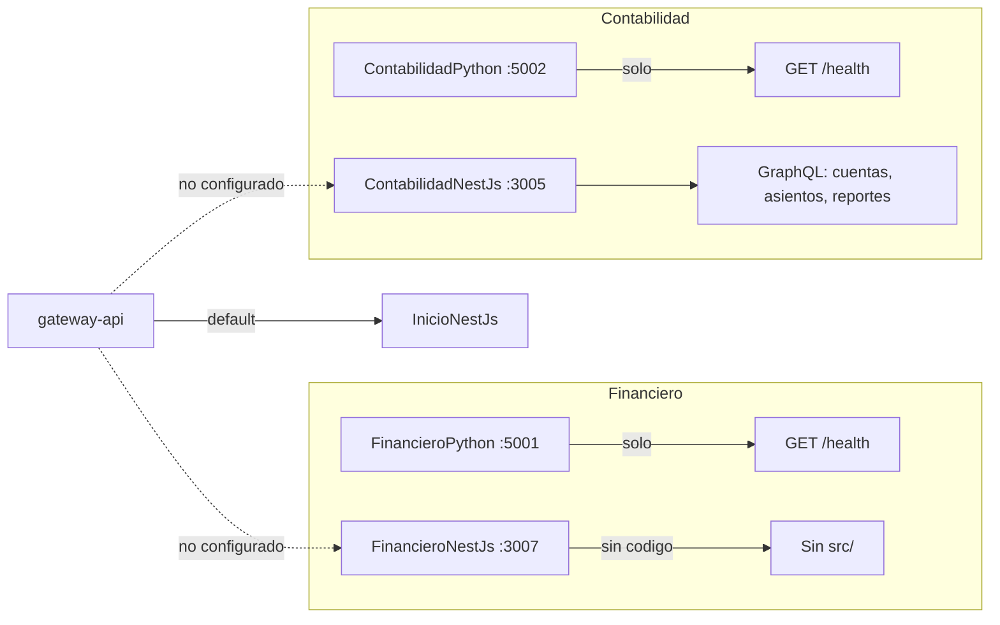
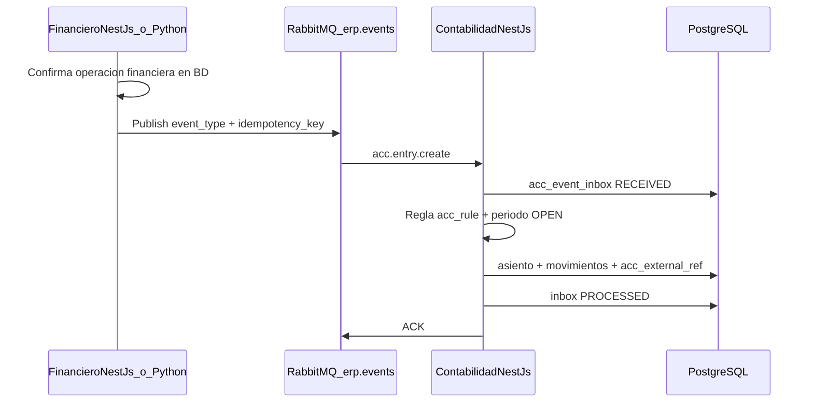

# Inventario: Financiero vs Contabilidad (NestJS y Python)

> Documento de referencia para continuar el trabajo en los módulos Financiero y Contabilidad.  
> Generado a partir del análisis del repositorio. Complementa [CONTABILIDAD_MODULO.md](./CONTABILIDAD_MODULO.md) (reglas de negocio y roadmap objetivo).

---

## Resumen comparativo

| Componente | Estado | Puerto (Docker) | Puerto (código local) | API de negocio |
|------------|--------|-----------------|------------------------|----------------|
| [FinancieroPython](../FinancieroPython/) | Esqueleto | 5001 | 5001 (`PORT`) | Solo `GET /health` |
| [FinancieroNestJs](../FinancieroNestJs/) | Esqueleto (sin `src/`) | 3007 | 3007 (`env.example`) | Ninguna (no compila) |
| [ContabilidadPython](../ContabilidadPython/) | Esqueleto | 5002 | 5002 (`PORT`) | Solo `GET /health` |
| [ContabilidadNestJs](../ContabilidadNestJs/) | Implementado (parcial) | 3005 | 3004 en `main.ts` / 3005 en `env.example` | GraphQL (cuentas, asientos, reportes) |

---

## 1. FinancieroPython

**Ubicación:** `FinancieroPython/`

### Archivos
- `app.py` — Flask + CORS + JWT (obligatorio `JWT_SECRET` / `JWT_SECRET_KEY`)
- `requirements.txt` — Flask, Flask-CORS, Flask-JWT-Extended, psycopg2, marshmallow, bcrypt (preparado para ampliar, sin uso aún)
- `Dockerfile`, `env.example`

### Endpoints

| Método | Ruta | Respuesta |
|--------|------|-----------|
| GET | `/health` | `{ "status": "ok", "service": "financiero-python" }` |

### Lo que NO tiene
- Rutas REST de negocio
- Modelos, repositorios, servicios
- Acceso a base de datos (aunque `DATABASE_URL` está en docker-compose)

### Infraestructura
- Docker: servicio `financiero-python-service` en `docker-compose.yml` (puerto **5001**)
- Gateway: variable `FINANCIERO_PY_BASE_URL` definida en compose, **sin rutas REST** en `gateway-api` que la usen

---

## 2. FinancieroNestJs

**Ubicación:** `FinancieroNestJs/`

### Archivos (solo scaffolding)
- `package.json` — dependencias NestJS, GraphQL, TypeORM, Apollo, pg
- `nest-cli.json`, `tsconfig.json`, `tsconfig.build.json`
- `Dockerfile`, `Dockerfile.dev`, `env.example`

### Lo crítico: no existe carpeta `src/`
No hay `main.ts`, módulos, entidades, resolvers ni servicios. El Dockerfile ejecuta `npm run build`, por lo que **el contenedor no puede construirse** con el código actual.

### Lo que NO tiene
- Código fuente NestJS
- Schema GraphQL
- Entidades TypeORM
- Migraciones SQL
- README de módulo

### Infraestructura
- Docker: `financiero-nestjs-service`, puerto **3007**
- Gateway: `FINANCIERO_NEST_GQL_URL` en compose, **sin enrutamiento** en `gateway-api/src/routes/graphql.js`
- Documentación (`docs/ARQUITECTURA_ERP_GENIE_SOLUTIONS_2025.md`): describe el módulo como “lectura/presentación financiero”, mismo patrón que Contabilidad, pero **sin implementar**

---

## 3. ContabilidadPython

**Ubicación:** `ContabilidadPython/`

### Archivos
- `app.py` — idéntico en estructura a FinancieroPython
- `requirements.txt` — mismas dependencias Flask
- `Dockerfile`, `env.example`

### Endpoints

| Método | Ruta | Respuesta |
|--------|------|-----------|
| GET | `/health` | `{ "status": "ok", "service": "contabilidad-python" }` |

### Rol previsto (según `docs/CONTABILIDAD_MODULO.md`)
Placeholder para futuro REST (exportaciones, reportes auxiliares). La generación de Excel/PDF se planea en un **módulo de reportes** aparte.

### Infraestructura
- Docker: `contabilidad-python-service`, puerto **5002**
- Gateway: `CONTABILIDAD_PY_BASE_URL` — sin uso en código del gateway

---

## 4. ContabilidadNestJs

**Ubicación:** `ContabilidadNestJs/`

### Stack
- NestJS 11 + GraphQL (Apollo) + TypeORM + PostgreSQL
- CORS: `src/config/cors.config.ts`
- `synchronize: false` en TypeORM

### Estructura de código

| Capa | Archivos |
|------|----------|
| Bootstrap | `src/main.ts` (puerto hardcodeado **3004**), `src/app.module.ts`, `src/app.controller.ts` (`GET /`, `GET /health`) |
| Entidades | `CuentaContable`, `AsientoContable`, `MovimientoContable`, `BalanceGeneral` en `src/entities/` |
| Servicios | `cuenta-contable.service.ts`, `asiento-contable.service.ts`, `reporte-contable.service.ts` |
| Resolvers | `cuenta-contable.resolver.ts`, `asiento-contable.resolver.ts`, `reporte-contable.resolver.ts` |
| DTOs GraphQL | balance-comprobacion, libro-mayor, estado-resultados, balance-general-saldos en `src/dto/` |
| Schema generado | `schema.gql` |

### API GraphQL actual (`schema.gql`)

**Queries — Cuentas**
- `cuentasContables`
- `cuentaContable(id)`
- `cuentasContablesPorTipo(tipo)`

**Queries — Asientos**
- `asientosContables`
- `asientoContable(id)`
- `asientosContablesPorFecha(fechaInicio, fechaFin)`

**Queries — Reportes** (llaman funciones SQL en PostgreSQL)
- `balanceComprobacion(empresaId, fechaDesde, fechaHasta)`
- `libroMayor(empresaId, cuentaId, fechaDesde, fechaHasta)`
- `estadoResultados(empresaId, fechaDesde, fechaHasta)`
- `balanceGeneralSaldos(empresaId, fechaCorte)`

**Mutations**
- `crearCuentaContable(...)`
- `crearAsientoContable(...)` — crea en estado `BORRADOR`, totales en 0
- `publicarAsiento(id)` — valida partida doble y líneas
- `reversarAsiento(id, usuarioId?)` — genera asiento reverso en transacción

### Lógica de negocio implementada en servicios
- **Publicar asiento** (`asiento-contable.service.ts`): BORRADOR → APROBADO; exige ≥2 líneas, debe = haber, sin líneas vacías ni con debe y haber simultáneos
- **Reversar asiento**: APROBADO → crea reverso + marca original `REVERSED`; usa `reversed_entry_id`
- **Numeración**: intenta función BD `obtener_siguiente_numero_asiento`; fallback local
- **Cuentas**: soft-delete vía `activa: false`
- **MovimientoContable**: entidad y repo usados internamente; **sin resolver GraphQL** para CRUD de líneas

### Migraciones SQL en el repo
Solo 2 archivos en `ContabilidadNestJs/migrations/`:
- `05_function_libro_mayor.sql` — función `libro_mayor(UUID, UUID, DATE, DATE)` alineada a esquema UUID
- `06_function_estado_resultados.sql` — función `estado_resultados(UUID, DATE, DATE)`

**No están en el repo** (pero el servicio las invoca): `balance_comprobacion`, `balance_general_saldos`, `obtener_siguiente_numero_asiento` (la doc menciona migraciones 01, 04, 07 que tampoco aparecen en esta carpeta).

### Desalineaciones importantes

1. **Puertos:** `main.ts` → 3004; `env.example` y Docker → **3005**
2. **Esquema BD vs TypeORM:** entidades usan `id: number`, `empresa_id: number`; migraciones SQL y doc apuntan a UUID (`id_asiento_contable`, `id_empresa`, etc.)
3. **Reportes:** funciones SQL esperan UUID; GraphQL y servicios pasan `Int`
4. **Entidad AsientoContable:** decoradores `@Column` duplicados en `estado` (posible error de compilación)
5. **Estados:** código usa `BORRADOR` / `APROBADO` / `REVERSED`; documentación objetivo habla de `DRAFT` / `POSTED` / etc.

### Infraestructura e integración
- Docker: `contabilidad-nestjs-service`, puerto **3005**
- Gateway: `CONTABILIDAD_NEST_GQL_URL` en compose; **graphql.js no enruta** queries de contabilidad → caen en **InicioNestJs** por defecto
- **Duplicado:** `InicioNestJs` también expone `cuentasContables` (usado hoy por el front en ítems/servicios vía gateway)
- Frontend: `frontReact/src/views/contabilidad/ContabilidadGeneral.tsx`, `ContabilidadConfiguracion.tsx` — placeholders sin llamadas a ContabilidadNestJs

### Documentación relacionada
- `docs/CONTABILIDAD_MODULO.md` — reglas de negocio objetivo, RBAC, RabbitMQ, gap analysis
- `MenuNestJs/migrations/` — permisos y menú lateral de Contabilidad

---

## 5. Financiero vs Contabilidad — diferencia clave

| Aspecto | Financiero (ambos) | Contabilidad |
|---------|-------------------|--------------|
| Python | Health check | Health check |
| NestJS | Sin código | GraphQL + TypeORM + reportes + publicar/reversar |
| Migraciones SQL | Ninguna | 2 funciones (libro mayor, estado resultados) |
| Frontend propio | No hay vistas `/financiero/*` | Vistas placeholder `/contabilidad/*` |
| Gateway | Variables env sin uso | Variables env sin enrutamiento GraphQL |
| Doc de módulo | Solo arquitectura general | `CONTABILIDAD_MODULO.md` detallado |

**Financiero** está reservado en la arquitectura (puertos 5001/3007) pero **no tiene desarrollo de negocio**. **Contabilidad** tiene el backend NestJS avanzado; Python sigue siendo shell.

---

## 6. Integración Financiero → Contabilidad (recomendación)

### Respuesta corta: sí, RabbitMQ (eventos), no llamada directa

**Contabilidad debe ser el único dueño de los asientos.** Financiero (y Facturación, Inventario, etc.) no crean asientos vía GraphQL/REST en ContabilidadNestJs; **publican eventos de dominio** y Contabilidad los consume, aplica reglas (`acc_rule`) y genera la transacción (asiento) de forma idempotente.

Esto ya está alineado con [CONTABILIDAD_MODULO.md](./CONTABILIDAD_MODULO.md) (secciones 10.3, 12): exchange `erp.events`, colas `acc.entry.create` / `acc.entry.reverse`, tabla `acc_event_inbox`, `idempotency_key`, `acc_external_ref`.

### Por qué RabbitMQ y no HTTP/GraphQL directo

| Criterio | RabbitMQ (eventos) | Llamada síncrona Financiero → Contabilidad |
|----------|-------------------|---------------------------------------------|
| Desacoplamiento | Financiero no depende de que Contabilidad esté arriba en el mismo instante | Si Contabilidad cae, falla el pago/cobro |
| Reintentos | Cola + DLQ + backoff | Hay que implementar reintentos a mano en cada módulo |
| Idempotencia | `idempotency_key` + inbox (evita doble asiento) | Riesgo de duplicar si hay timeout y reintento |
| Trazabilidad | Payload + `acc_external_ref` (documento origen) | Posible, pero cada módulo lo haría distinto |
| Reglas contables | Un solo motor en Contabilidad (`acc_rule`) | Lógica contable duplicada o acoplada |

**GraphQL de Contabilidad** queda para: consultas, asientos manuales, publicar/reversar desde UI, reportes. **No** para que Financiero “inserte” el asiento en caliente.

### Flujo propuesto

### Contrato de eventos (extender el de Facturación)

Mismo esquema base que en CONTABILIDAD_MODULO (10.4): `event_id`, `event_type`, `occurred_at`, `tenant.empresa_id`, `actor.usuario_id`, `document`, `amounts`, `accounting.journal_code`, `idempotency_key`.

**Routing keys sugeridas para Financiero** (prefijo `financial.`):

| Evento | Routing key | Acción en Contabilidad |
|--------|-------------|------------------------|
| Cobro registrado | `financial.payment.received` | Crear asiento (caja/banco vs CxC) |
| Pago a proveedor | `financial.payment.sent` | Crear asiento (CxP vs banco) |
| Transferencia entre cuentas | `financial.transfer.created` | Crear asiento (banco ↔ banco) |
| Anulación de cobro/pago | `financial.payment.voided` | Reversar asiento (`acc.entry.reverse`) |
| Nota de débito/crédito financiera | `financial.adjustment.created` | Crear según regla |

Facturación seguiría con `billing.*`; **un solo consumidor** en ContabilidadNestJs resuelve por `event_type` / `document.type` la regla contable.

### Quién publica y quién consume

| Rol | Servicio | Responsabilidad |
|-----|----------|-----------------|
| **Productor** | FinancieroNestJs (o FinancieroPython en escrituras REST) | Tras persistir el movimiento financiero, publicar evento (ideal: **outbox** en la misma transacción BD → worker publica a Rabbit) |
| **Broker** | RabbitMQ | Exchange topic `erp.events`; colas `acc.entry.create`, `acc.entry.reverse` + DLQ |
| **Consumidor** | **ContabilidadNestJs** | Motor de contabilización: inbox, reglas, asiento, publicación (POSTED), reversión |

Hoy **no hay RabbitMQ en docker-compose**; hay que añadirlo como infraestructura compartida del ERP.

### Alternativa solo para MVP muy acotado

Si antes de montar Rabbit se necesita un prototipo:

1. **Outbox en tabla** `financial_event_outbox` + job que llame a un endpoint interno de Contabilidad — aceptable temporalmente, pero migrar a Rabbit en cuanto haya más de un módulo emisor (Facturación + Financiero).
2. **No recomendado**: `POST` síncrono desde Financiero a `crearAsientoContable` en GraphQL — acopla módulos y complica idempotencia.

### Pasos de implementación (orden sugerido)

1. Infra: RabbitMQ en `docker-compose` + variables `RABBITMQ_URL` en servicios.
2. BD Contabilidad: `acc_event_inbox`, `acc_external_ref`, `acc_rule` / `acc_rule_line`, `acc_journal`, `acc_period`.
3. Consumidor en **ContabilidadNestJs** (único motor de asientos automáticos).
4. Productor en **FinancieroNestJs** (o Python) con outbox + `idempotency_key` por operación.
5. Reglas contables por `document_type` (ej. `FIN_PAYMENT_RECEIVED`) y diario `BANCO` / `GENERAL`.
6. Pruebas: mismo evento dos veces → un solo asiento; anulación → reverso enlazado.

---

## 7. Próximos pasos sugeridos

### Contabilidad
- [ ] Alinear entidades NestJS con esquema UUID real de BD
- [ ] Completar migraciones SQL faltantes (`balance_comprobacion`, `balance_general_saldos`)
- [ ] Unificar puerto (3004 vs 3005) en `main.ts`, `env.example` y Docker
- [ ] Enrutar GraphQL en `gateway-api/src/routes/graphql.js` hacia ContabilidadNestJs
- [ ] CRUD GraphQL de `MovimientoContable`, diarios, periodos, motor RabbitMQ, RBAC
- [ ] Conectar vistas React en `frontReact/src/views/contabilidad/`

### Financiero
- [ ] Definir alcance funcional (tesorería, bancos, CxC/CxP, etc.)
- [ ] Crear `src/` en FinancieroNestJs o quitar servicio Docker hasta tener código
- [ ] Implementar dominio financiero (persistencia propia); **no** crear asientos en Contabilidad por API directa
- [ ] Publicar eventos a Rabbit (`financial.*`) con `idempotency_key` (patrón outbox recomendado)

### Integración Financiero ↔ Contabilidad (RabbitMQ)
- [ ] Añadir RabbitMQ al stack Docker del ERP
- [ ] Tablas `acc_event_inbox`, `acc_external_ref`, reglas `acc_rule` en Contabilidad
- [ ] Consumidor de eventos en ContabilidadNestJs (`acc.entry.create` / `acc.entry.reverse`)
- [ ] Productor de eventos en FinancieroNestJs tras confirmar cobros/pagos/transferencias
- [ ] Definir routing keys `financial.*` y reglas contables asociadas
