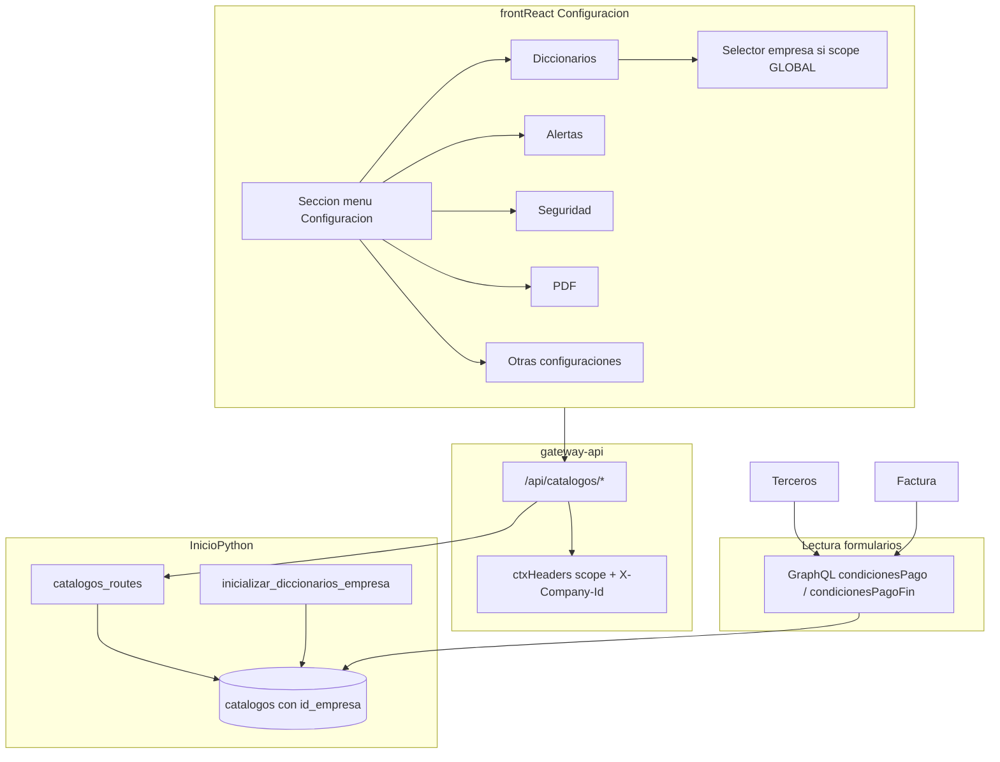

# Plan: Configuración global y diccionarios por empresa

> **Estado:** Pendiente de ejecución — **BLOQUEADO**  
> **Prerequisito:** [PLAN_CONTABILIDAD_COMPLETO.md](./PLAN_CONTABILIDAD_COMPLETO.md) (Fases 1–4 del módulo Contabilidad; Informes en Fase 5)  
> **Creado:** 2026-05-28  
> **Origen:** Conversación Facturación / Diccionarios estilo Dolibarr  
> **Copia de respaldo:** también en `.cursor/plans/config_global_diccionarios_ccf64dc4.plan.md`

## Resumen

Reorganizar la configuración estilo Dolibarr: nueva sección superior **Configuración** con Diccionarios, Alertas, Seguridad, PDF y Otras configuraciones; migrar catálogos (condiciones de pago, modos de pago, etc.) a **ámbito por empresa** con control de acceso para administrador global, siguiendo el patrón multiempresa de Terceros.

## Todos de implementación

| ID | Tarea | Estado |
|----|-------|--------|
| `sql-empresa-catalogos` | Migración SQL: id_empresa en tablas catálogo, unique compuesto, seeds Dolibarr y copia por empresa | pendiente |
| `python-catalogos-empresa` | InicioPython: filtro id_empresa, auth admin/GLOBAL, inicializar_diccionarios_empresa al crear empresa | pendiente |
| `gateway-catalogos-headers` | Gateway catalogos.js: proxy con ctxHeaders + ruta inicializar-empresa | pendiente |
| `graphql-lectura-empresa` | InicioNestJs/FinancieroNestJs/TerceroNestJs: queries catálogo con id_empresa | pendiente |
| `menu-config-global` | SQL menú: sección Configuración + ítems Diccionarios/Alertas/Seguridad/PDF/Otras + permisos admin | pendiente |
| `frontend-config-modulo` | frontReact: módulo /configuracion con selector empresa GLOBAL, mover diccionarios, shells nuevas pantallas | pendiente |
| `integracion-factura-tercero` | Factura y selects tercero: catálogos filtrados por empresa + herencia condición/modo del tercero | pendiente |

---

## Contexto actual

- **Condiciones de pago** ya tienen CRUD en `frontReact/src/views/financiero/configuracion/diccionarios/` y REST en `InicioPython/api/catalogos_routes.py`.
- Los catálogos son **globales** (sin `id_empresa`); la factura los consume vía `condicionesPagoFin` en `NuevaFacturaCliente.tsx`.
- El menú **Diccionarios** está suelto bajo Financiero (`docs/sql/2026-05-17_menu_diccionarios.sql`), no hay sección global Configuración.
- El patrón multiempresa de Terceros usa `scope_acceso` (`GLOBAL` / `EMPRESA`) + selector de empresa en UI + cabeceras `X-Company-Id` resueltas en gateway (`gateway-api/src/services/terceroPython.js` → `ctxHeaders`).

## Arquitectura objetivo



## Fase 1 — Base de datos (migración)

Crear `docs/sql/2026-05-28_diccionarios_por_empresa.sql`:

| Tabla | Cambio |
|-------|--------|
| `condicion_pago_catalogo` | `id_empresa uuid NOT NULL` + FK `empresa` |
| `forma_pago_catalogo` | idem |
| `formato_papel_catalogo` | idem |
| `tipo_entidad_comercial` | idem (catálogo usado en Terceros) |
| `moneda` | idem (monedas habilitadas por empresa) |

- Reemplazar `UNIQUE(codigo)` por `UNIQUE(id_empresa, codigo)` en cada tabla.
- **Migración de datos existentes**: asignar filas actuales a cada `empresa` activa (copia por empresa) o a empresa plantilla `a0000000-0000-4000-8000-000000000001` y luego clonar al resto.
- **Seeds Dolibarr** (condiciones de pago para facturación), por empresa:

| Código | Etiqueta | Días | Fin mes |
|--------|----------|------|---------|
| RECEP | Acuse de recibo | 0 | ninguno |
| 30D | 30 días | 30 | ninguno |
| 30D_FDM | 30 días a fin de mes | 30 | fin_mes |
| 60D | 60 días | 60 | ninguno |
| 60D_FDM | 60 días fin de mes | 60 | fin_mes |
| ORDEN | Orden | 0 | ninguno |
| ENTREGA | A la entrega | 0 | ninguno |
| 50_50 | 50/50 | 0 | ninguno (depósito 50%) |

- Endpoint/servicio `POST /api/catalogos/inicializar-empresa` para clonar seeds a una empresa nueva.

## Fase 2 — Backend escritura (InicioPython)

Actualizar `InicioPython/models/catalogos_diccionario.py` y `catalogos_routes.py`:

- Todas las consultas filtran por `id_empresa` recibido en header `X-Company-Id`.
- En `POST`, forzar `id_empresa` desde contexto (no confiar en el body).
- **Autorización** (nuevo helper `utils/empresa_context.py`):
  - Usuario `scope_acceso = EMPRESA`: solo su `id_empresa` del JWT.
  - Usuario `GLOBAL` o `administrador_sistema`: puede enviar `X-Company-Id` para administrar cualquier empresa.
  - Usuarios sin perfil admin: rechazar escritura en diccionarios (403).
- Hook en `InicioPython/api/empresa_routes.py` `crear_empresa`: tras commit, llamar `inicializar_diccionarios_empresa(id_empresa)`.

## Fase 3 — Backend lectura (GraphQL)

Actualizar resolvers para filtrar por empresa:

- `InicioNestJs/src/resolvers/catalogos-pago.resolver.ts` — `condicionesPago`, `formasPago` + arg `id_empresa`.
- `FinancieroNestJs/src/resolvers/financiero.resolver.ts` — `condicionesPagoFin`, `formasPagoFin`, `monedasFin`.
- `InicioNestJs/src/resolvers/tipo-entidad-comercial.resolver.ts` — `tiposEntidadComercial`.
- Entidades TypeORM: añadir columna `id_empresa` y alinear `TerceroNestJs` (hoy desalineadas con esquema viejo).

## Fase 4 — Gateway

- `gateway-api/src/routes/catalogos.js`: dejar de usar `pythonService.call` genérico; usar proxy con `ctxHeaders` (como `contabilidadPython.js`) para propagar `Authorization`, `X-User-Id`, `X-Company-Id`.
- Añadir ruta `POST /api/catalogos/inicializar-empresa`.
- `gateway-api/src/routes/graphql.js`: sin cambio de destino; las queries ya van a InicioNestJs / FinancieroNestJs.

## Fase 5 — Menú: sección global Configuración

Nueva migración `docs/sql/2026-05-28_menu_configuracion_global.sql`:

1. **`menu_seccion`** nueva: `Configuración` (icono `bi bi-gear`, orden ~14).
2. **`menu_item`** hijos (todos `es_clickable = true`):

| Etiqueta | Ruta |
|----------|------|
| Diccionarios | `/configuracion/diccionarios` |
| Alertas | `/configuracion/alertas` |
| Seguridad | `/configuracion/seguridad` |
| PDF | `/configuracion/pdf` |
| Otras configuraciones | `/configuracion/otras` |

3. **Permisos** `perfil_menu_permiso`: perfiles `admin` / `%admin%` y opcionalmente usuarios con `administrador_sistema`.
4. **Deprecar** ítem Financiero `/financiero/configuracion/diccionarios` (desactivar o redirigir) para evitar duplicado.

Subrutas de diccionarios (sin ítem de menú cada una, como hoy):

```
/configuracion/diccionarios/condiciones-pago
/configuracion/diccionarios/modos-pago
/configuracion/diccionarios/monedas
/configuracion/diccionarios/tipo-entidad-legal
/configuracion/diccionarios/formatos-papel
```

## Fase 6 — Frontend

### Estructura nueva

Mover/adaptar vistas a `frontReact/src/views/configuracion/`:

- `ConfiguracionLayout.tsx` — layout común con **selector de empresa** si `scope_acceso === 'GLOBAL'` (patrón de `Terceros.tsx`).
- `diccionarios/*` — reutilizar `DiccionarioCrudPage`, `CondicionesPagoDiccionario`, etc.
- `Alertas.tsx`, `Seguridad.tsx`, `Pdf.tsx`, `OtrasConfiguraciones.tsx` — **fase 1: pantallas base** con mensaje “en construcción” y estructura de guardado futuro por empresa (sin bloquear el menú).

### Cambios clave

- `frontReact/src/_apis_/catalogos.js`: interceptor que envía `X-Company-Id` de empresa seleccionada (GLOBAL) o JWT (EMPRESA).
- `frontReact/src/routes/Router.tsx`: rutas `/configuracion/*`; mantener redirect desde rutas `/financiero/configuracion/diccionarios/*` hacia las nuevas.
- Componentes select: `SelectCondicionPago.tsx`, `SelectFormaPago.tsx` — pasar `id_empresa` en variables GraphQL.
- `NuevaFacturaCliente.tsx`: filtrar catálogos por empresa de la factura; **heredar** `id_condicion_pago` / `id_forma_pago` del tercero al seleccionar cliente.

## Fase 7 — Control de acceso UI

- Mostrar sección **Configuración** solo a perfiles con permiso de menú (ya resuelto por `MenuNestJs`).
- En vistas de diccionarios: si usuario no es admin, mostrar alerta de solo lectura o bloquear botones de alta/edición.
- Validar en backend (no solo en menú).

## Orden de implementación recomendado

1. SQL migración `id_empresa` + seeds + copia a empresas existentes.
2. InicioPython (filtros, auth, inicializar empresa).
3. Gateway `ctxHeaders` en catálogos.
4. GraphQL lectura por empresa + alinear TerceroNestJs.
5. Menú SQL sección Configuración.
6. Frontend rutas + selector empresa + mover diccionarios.
7. Integración factura/tercero con catálogos filtrados.
8. Pantallas shell Alertas / Seguridad / PDF / Otras.

## Riesgos y mitigaciones

| Riesgo | Mitigación |
|--------|------------|
| FKs rotas en `tercero` / `factura` tras migración | Copiar catálogos por empresa y remapear IDs o migrar en bloque por empresa |
| `tipo_entidad_comercial` usa PK smallint | Mantener PK; unicidad pasa a `(id_empresa, nombre)` |
| Gateway catálogos sin headers hoy | Prioridad en fase 4 |
| Duplicar menú Financiero vs Configuración | Desactivar ítem antiguo + redirect en Router |

## Fuera de alcance inicial (fase 2 futura)

- Cálculo automático de `fecha_vencimiento` desde condición de pago.
- Configuración avanzada de plantillas PDF (más allá de formatos de papel).
- Tablas dedicadas para alertas/seguridad (hoy solo shells de UI).

## Decisiones acordadas

- **Catálogos:** por empresa (cada empresa tiene su propio catálogo; admin global gestiona todas).
- **Menú:** nueva sección superior global **Configuración** (estilo Dolibarr), no solo bajo Financiero.
