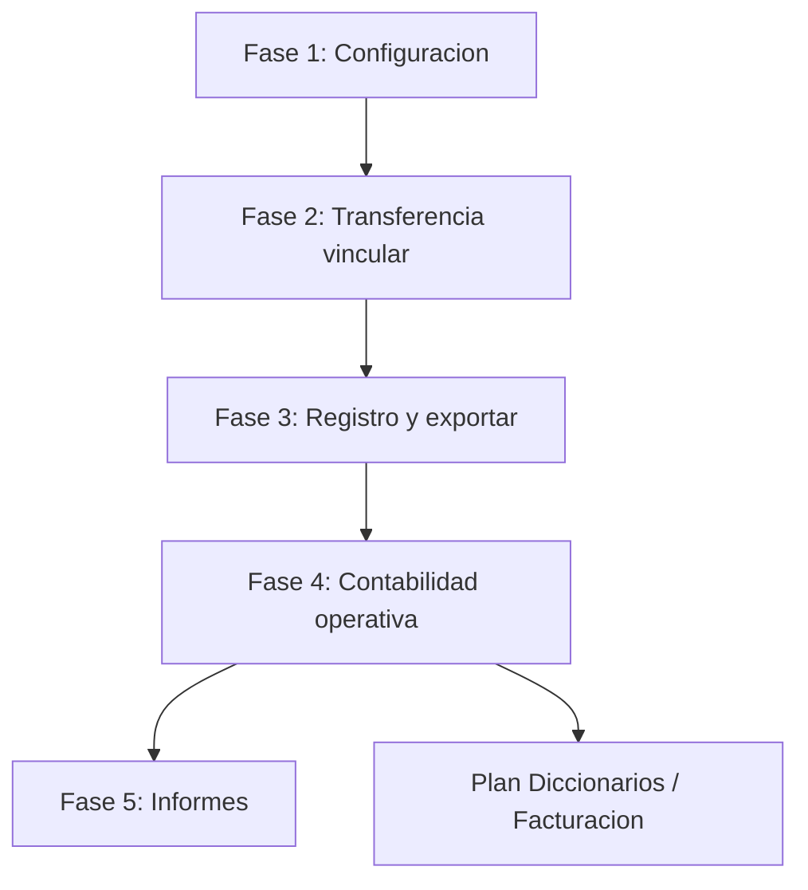
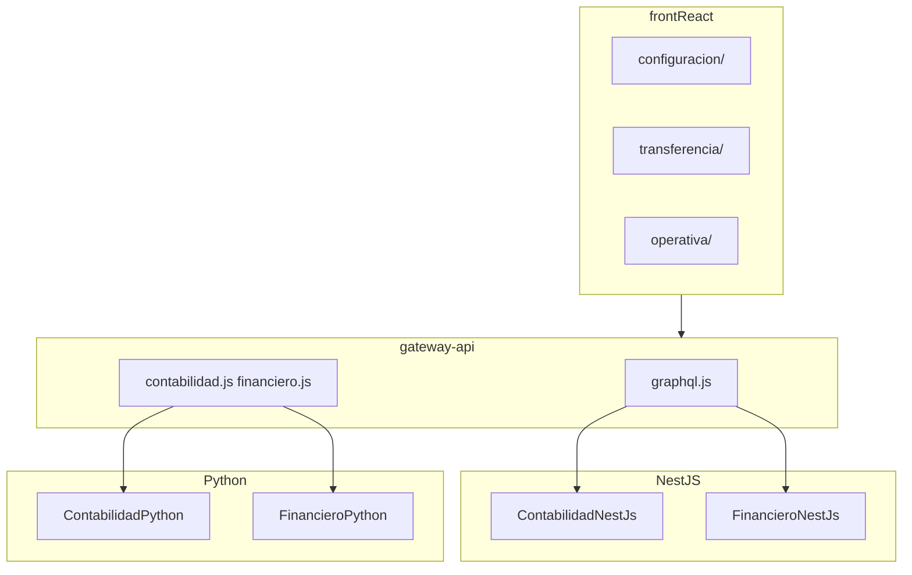

# Plan único: Módulo Contabilidad (ErpGenieSolutions2025)

> **Estado:** Pendiente de ejecución  
> **Creado / actualizado:** 2026-05-28  
> **Documento maestro** — reemplaza planes parciales en esta carpeta  
> **Bloquea:** [PLAN_CONFIG_GLOBAL_DICCIONARIOS.md](./PLAN_CONFIG_GLOBAL_DICCIONARIOS.md) hasta completar Fases 1–4

---

## Visión general



| Fase | Nombre | Menú BD | Estado |
|------|--------|---------|--------|
| **1** | Configuración contable | `/contabilidad/configuracion/*` | 7 hechas, 6 pendientes |
| **2** | Transferencia — vincular facturas | `/contabilidad/transferencia/facturas-*` | Pendiente |
| **3** | Transferencia — registro + exportar | `/contabilidad/transferencia/registro/*` + `exportar-documentos` | Pendiente |
| **4** | Contabilidad operativa | `/contabilidad` + libro mayor, diarios, saldo, exportar, cerrar | Pendiente |
| **5** | Informes contables | `/contabilidad/informes` | Fase posterior |

---

## Árbol completo de menú Contabilidad

```
Contabilidad
├── Configuración                          /contabilidad/configuracion
│   ├── General                            /contabilidad/configuracion/general                    [HECHO]
│   ├── Diarios contables                  /contabilidad/configuracion/diarios                  [HECHO]
│   ├── Modelos de planes                  /contabilidad/configuracion/modelos-planes           [HECHO]
│   ├── Plan contable                      /contabilidad/configuracion/plan-contable            [HECHO]
│   ├── Plan cuentas individuales          /contabilidad/configuracion/cuentas-individuales   [HECHO]
│   ├── Periodo contable                   /contabilidad/configuracion/periodo                [HECHO]
│   ├── Cuentas contables por defecto      /contabilidad/configuracion/cuentas-defecto        [HECHO]
│   ├── Cuentas Bancarias                  /contabilidad/configuracion/cuentas-bancarias      [PENDIENTE]
│   ├── Cuentas de IVA                     /contabilidad/configuracion/cuentas-iva            [PENDIENTE]
│   ├── Cuentas de impuestos               /contabilidad/configuracion/cuentas-impuestos      [PENDIENTE]
│   ├── Cuentas contables de productos     /contabilidad/configuracion/cuentas-productos     [PENDIENTE]
│   ├── Cerrar cuentas                     /contabilidad/configuracion/cerrar-cuentas         [PENDIENTE]
│   └── Grupo personalizado de cuentas     /contabilidad/configuracion/grupos-personalizados  [PENDIENTE]
│
├── Transferencia en contabilidad          /contabilidad/transferencia
│   ├── Contabilizar facturas a clientes   /contabilidad/transferencia/facturas-clientes
│   │   ├── Líneas a contabilizar          .../facturas-clientes/lineas-a-contabilizar
│   │   └── Líneas contabilizadas          .../facturas-clientes/lineas-contabilizadas
│   ├── Contabilizar facturas proveedores  /contabilidad/transferencia/facturas-proveedores
│   │   ├── Líneas a contabilizar          .../facturas-proveedores/lineas-a-contabilizar
│   │   └── Líneas contabilizadas          .../facturas-proveedores/lineas-contabilizadas
│   ├── Registro en contabilidad          /contabilidad/transferencia/registro  (agrupador)
│   │   ├── Ventas (Diario VT)             /contabilidad/transferencia/registro/ventas        [FASE 3]
│   │   ├── Compras (Diario AC)            /contabilidad/transferencia/registro/compras       [FASE 3]
│   │   └── Banco (Diario BQ)              /contabilidad/transferencia/registro/banco        [FASE 3]
│   └── Exportar documentos de origen      /contabilidad/transferencia/exportar-documentos    [FASE 3]
│
└── Contabilidad (operativa)               /contabilidad
    ├── Área contabilidad (inicio)         /contabilidad                                    [FASE 4]
    ├── Asientos Contables                 /contabilidad/asientos                           [FASE 4]
    ├── Libro Mayor                        /contabilidad/libro-mayor                        [FASE 4]
    ├── Diarios                            /contabilidad/diarios                            [FASE 4]
    ├── Saldo de la cuenta                 /contabilidad/saldo-cuenta                       [FASE 4]
    ├── Exportar contabilidad              /contabilidad/exportar                           [FASE 4]
    ├── Cerrar                             /contabilidad/cerrar                             [FASE 4]
    └── Informes                           /contabilidad/informes                           [FASE 5]
```

---

## Todos maestro (implementación)

| ID | Fase | Tarea | Estado |
|----|------|-------|--------|
| `contab-sql-cierre-grupos` | 1 | Migración SQL cierre + grupos + id_diario bancario | pendiente |
| `contab-cuentas-bancarias` | 1 | Vista + backend Cuentas Bancarias | pendiente |
| `contab-cuentas-iva` | 1 | CRUD cuenta_iva | pendiente |
| `contab-cuentas-impuestos` | 1 | CRUD cuenta_impuesto | pendiente |
| `contab-cuentas-productos` | 1 | Vista wrapper cuentas-defecto PRODUCTO | pendiente |
| `contab-cerrar-cuentas` | 1 | Vista parámetros cierre ejercicio | pendiente |
| `contab-grupos-personalizados` | 1 | CRUD grupos informes + cuentas | pendiente |
| `transf-sql-modelo` | 2 | Migración factura_linea vinculado/transferido | pendiente |
| `transf-facturas-clientes` | 2 | Hub + líneas clientes (3 pantallas) | pendiente |
| `transf-facturas-proveedores` | 2 | Hub + líneas proveedores (3 pantallas) | pendiente |
| `registro-ventas` | 3 | Procesar diario VT — pantalla Dolibarr | pendiente |
| `registro-compras` | 3 | Procesar diario AC — pantalla Dolibarr | pendiente |
| `registro-banco` | 3 | Procesar diario BQ — pantalla Dolibarr | pendiente |
| `exportar-documentos-origen` | 3 | Exportar ZIP/CSV documentos origen | pendiente |
| `transf-backend` | 2–3 | GraphQL lectura + REST escritura transferencia/registro | pendiente |
| `transf-rutas-gateway` | 2–3 | Router + gateway todas rutas transferencia | pendiente |
| `operativa-area` | 4 | Dashboard Área contabilidad con pasos 1–9 y A–E | pendiente |
| `operativa-libro-mayor` | 4 | Vista Libro Mayor por cuenta | pendiente |
| `operativa-diarios` | 4 | Vista Diarios operativa (todas las operaciones) | pendiente |
| `operativa-saldo-cuenta` | 4 | Vista Saldo de la cuenta + export CSV | pendiente |
| `operativa-exportar` | 4 | Vista Exportar contabilidad (marcar exportados) | pendiente |
| `operativa-cerrar` | 4 | Vista Cerrar periodo contable | pendiente |
| `operativa-asientos` | 4 | Vista listado Asientos Contables | pendiente |
| `operativa-backend` | 4 | GraphQL reportes + migración fecha_exportacion | pendiente |
| `operativa-rutas` | 4 | Router + gateway rutas operativas | pendiente |
| `informes-*` | 5 | Informes contables (fase posterior) | pendiente |

---

# FASE 1 — Configuración contable

## Completado (no repetir)

| Pantalla | Ruta |
|----------|------|
| General | `/contabilidad/configuracion/general` |
| Periodo contable | `/contabilidad/configuracion/periodo` |
| Diarios contables | `/contabilidad/configuracion/diarios` |
| Modelos de planes | `/contabilidad/configuracion/modelos-planes` |
| Plan contable | `/contabilidad/configuracion/plan-contable` |
| Plan cuentas individuales | `/contabilidad/configuracion/cuentas-individuales` |
| Cuentas contables por defecto | `/contabilidad/configuracion/cuentas-defecto` |

## Pendiente Fase 1

| Pantalla | Ruta | Tablas |
|----------|------|--------|
| Cuentas Bancarias | `/contabilidad/configuracion/cuentas-bancarias` | `cuenta_bancaria`, `movimiento_bancario` |
| Cuentas de IVA | `/contabilidad/configuracion/cuentas-iva` | `cuenta_iva` |
| Cuentas de impuestos | `/contabilidad/configuracion/cuentas-impuestos` | `cuenta_impuesto` |
| Cuentas productos | `/contabilidad/configuracion/cuentas-productos` | `cuenta_contable_defecto` (PRODUCTO) |
| Cerrar cuentas | `/contabilidad/configuracion/cerrar-cuentas` | `configuracion_contabilidad` + cols cierre |
| Grupos personalizados | `/contabilidad/configuracion/grupos-personalizados` | `grupo_cuenta_personalizado` |

### Migración `11_config_contable_cierre_grupos_bancos.sql`

- `configuracion_contabilidad`: `id_cuenta_resultado_ganancia`, `id_cuenta_resultado_perdida`, `id_diario_cierre`, `grupos_cuenta_balance`, `grupos_cuenta_resultado`
- `grupo_cuenta_personalizado`: `codigo`, `etiqueta`, `comentario`, `calculado`, `formula`, `posicion`, `id_pais`
- `cuenta_bancaria`: `id_diario_contable`

### Backend Fase 1

- **Lectura:** ContabilidadNestJs GraphQL; cuentas bancarias ampliadas en FinancieroNestJs
- **Escritura:** ContabilidadPython REST; FinancieroPython `/api/cuentas-bancarias`
- **Patrón:** `id_empresa` + `ctxHeaders` (usuario GLOBAL con selector empresa)

---

# FASE 2 — Transferencia: vincular facturas

Vincular líneas de factura a cuentas del plan **antes** del registro en diarios.

## Pantallas

### Hub anual — Clientes `/contabilidad/transferencia/facturas-clientes`

- Selector año `< 2025 >`
- Botón **VINCULAR AUTOMÁTICAMENTE**
- Tabla resumen líneas **no vinculadas** (cuenta × meses ene…dic × total)
- Tabla resumen líneas **vinculadas**
- Enlaces: Líneas a contabilizar | Líneas contabilizadas

### Líneas a contabilizar — Clientes

- Tabla filtrable: Id línea, Factura, Fecha, Ref. producto, Descripción, Importe, Tasa IVA, Tercero, País, CIF, Cuenta sugerida
- Acción masiva + **CONFIRMAR**

### Líneas contabilizadas — Clientes

- Tabla con cuenta asignada
- Barra: cambiar cuenta del plan para seleccionadas + **CAMBIAR LA UNIÓN**

### Proveedores

Misma estructura en `/contabilidad/transferencia/facturas-proveedores/*` filtrando `tercero.proveedor`.

## Modelo datos Fase 2

Migración `12_transferencia_contable.sql` en `factura_linea`:

| Columna | Uso |
|---------|-----|
| `tasa_iva` | % IVA en UI |
| `id_cuenta_sugerida` | Propuesta automática |
| `vinculado` | Tiene cuenta asignada |
| `transferido` | Ya en asiento |
| `id_asiento_contable` | Asiento generado |

## Motor cuenta sugerida

1. Cuenta en ficha ítem  
2. `cuenta_contable_defecto` (PRODUCTO/SERVICIO venta o compra)  
3. Subcuenta tercero (cliente/proveedor)

## API Fase 2

```
POST /api/transferencia-contable/facturas-clientes/vincular-automatico
POST /api/transferencia-contable/facturas-proveedores/vincular-automatico
PATCH /api/transferencia-contable/lineas/vincular
PATCH /api/transferencia-contable/lineas/cambiar-cuenta
```

GraphQL: `resumenVinculacionFacturas`, `lineasFacturaTransferencia`

---

# FASE 3 — Transferencia: registro en contabilidad + exportar

Pantallas **Procesar diarios** (Dolibarr). Requieren Fase 1 (periodo + cuentas defecto) y Fase 2 (líneas vinculadas).

## Componente común: `ProcesarDiarioPage.tsx`

Props: `codigoDiario` (`VT` | `AC` | `BQ`), `titulo`, `descripcion`, `origen` (`ventas` | `compras` | `banco`).

### Cabecera (las 3 pantallas de registro)

| Campo | Descripción |
|-------|-------------|
| **Nombre** | Ej. "Generación de asientos contables - VT - Ventas" |
| **Periodo de análisis** | Rango fechas Desde / Hasta |
| **Estado de diario** | Select: "Aún no transferido a los diarios contables y al libro mayor" (y otros estados futuros) |
| **Descripción** | Texto fijo según diario; ventas/compras: "facturas de anticipo incluidas" |
| **REFRESCAR** | Recarga tabla según filtros |

### Alertas de prerequisitos (banner amarillo)

Mostrar si falta configuración (como Dolibarr PASO 4):

1. **Periodo contable:** enlace a `/contabilidad/configuracion/periodo` — "Defina un año fiscal / periodo por defecto"
2. **Cuentas por defecto:** enlace a `/contabilidad/configuracion/cuentas-defecto` — "Defina cuentas predeterminadas obligatorias"

Deshabilitar **REGISTRAR TRANSACCIONES EN CONTABILIDAD** si prerequisitos no cumplidos o tabla vacía.

### Botón principal

**REGISTRAR TRANSACCIONES EN CONTABILIDAD** → `POST /api/transferencia-contable/registro/{ventas|compras|banco}`

---

## 3.1 Registro Ventas — `/contabilidad/transferencia/registro/ventas`

**Diario:** VT (Ventas)  
**Origen:** `factura_linea` vinculadas, `transferido = false`, tercero cliente  
**Respetar:** `deshabilitar_transferencia_ventas`

### Tabla "Procesar diarios"

| Columna | Campo |
|---------|-------|
| Fecha | `fecha_factura` |
| Doc. contabilidad (Ref. factura) | `numero_factura` / id |
| Cuenta contable | código cuenta plan |
| Subcuenta contable | subcuenta tercero si aplica |
| Etiqueta operación | según `etiqueta_operacion_defecto` en config |
| Debe | importe debe |
| Haber | importe haber |

Genera `asiento_contable` + `movimiento_contable` en diario VT; marca `transferido = true`.

---

## 3.2 Registro Compras — `/contabilidad/transferencia/registro/compras`

**Diario:** AC (Compras)  
**Origen:** facturas proveedor vinculadas  
**Respetar:** `deshabilitar_transferencia_compras`

Misma UI que Ventas; columnas idénticas. Incluye facturas de anticipo proveedor.

---

## 3.3 Registro Banco — `/contabilidad/transferencia/registro/banco`

**Diario:** BQ (Banco / Diario financiero)  
**Origen:** `movimiento_bancario` sin `id_asiento_contable`  
**Filtro:** solo `conciliado = true` si `solo_lineas_conciliadas_extracto` en config

### Tabla (columna extra vs ventas/compras)

| Columna | Campo |
|---------|-------|
| Fecha | `fecha_movimiento` |
| Doc. contabilidad (Ref. objeto origen) | referencia movimiento |
| Cuenta contable | cuenta bancaria → plan |
| Subcuenta contable | si aplica |
| Etiqueta operación | `concepto` |
| **Forma de pago** | `forma_pago` / catálogo |
| Debe | monto si cargo |
| Haber | monto si abono |

---

## 3.4 Exportar documentos de origen — `/contabilidad/transferencia/exportar-documentos`

### UI (captura Dolibarr)

- Texto: exportación ZIP con CSV + adjuntos originales (PDF, etc.)
- **Periodo de análisis:** fecha Desde / Hasta + enlace "Ahora"
- **Tipos de documento** (checkboxes):

| Checkbox | Fase inicial | Fase futura |
|----------|--------------|-------------|
| Facturas (cliente) | Sí | — |
| Facturas proveedor | Sí | — |
| Donaciones | No | módulo donaciones |
| Impuestos sociales o fiscales | No | — |
| Pagos de salarios | No | RRHH |
| Pago varios | Parcial | `pago` |
| Pago de préstamo | No | — |

- Botón **BUSCAR** → genera exportación

### Backend

```
GET /api/transferencia-contable/exportar-documentos?desde=&hasta=&tipos[]=facturas&tipos[]=facturas_proveedor
```

- Respuesta: ZIP con CSV (config `separador_columnas`, `formato_fecha_exportacion`) + PDFs si existen en módulo documentos
- Fase inicial: solo CSV de metadatos facturas; ZIP completo en iteración 2

---

## API Fase 3 (ContabilidadPython)

```
GET  /api/transferencia-contable/registro/ventas/preview
GET  /api/transferencia-contable/registro/compras/preview
GET  /api/transferencia-contable/registro/banco/preview
POST /api/transferencia-contable/registro/ventas
POST /api/transferencia-contable/registro/compras
POST /api/transferencia-contable/registro/banco
GET  /api/transferencia-contable/exportar-documentos
```

Servicio `RegistroContableService`:

- Valida periodo contable abierto en rango
- Valida cuentas defecto mínimas configuradas
- Partida doble (total debe = total haber)
- Numeración `numeracion_modelo` (neon/argon/helium)
- Transacción atómica

GraphQL preview: `lineasRegistroContable(id_empresa, diario, desde, hasta, estado)`

---

# FASE 4 — Contabilidad operativa

Consulta y gestión de asientos ya registrados en el libro mayor. Requiere Fases 1–3 completadas (hay movimientos en `asiento_contable` / `movimiento_contable`).

## 4.0 Área contabilidad (landing) — `/contabilidad`

**Al hacer clic en el menú superior "Contabilidad"** (ruta raíz del módulo operativo).

### UI — Panel "Área contabilidad"

Guía tipo Dolibarr con pasos enlazados al estado real de la empresa:

**Configuración inicial (PASO 1–9):**

| Paso | Texto | Enlace |
|------|-------|--------|
| 1 | Verificar lista de diarios | `/contabilidad/configuracion/diarios` |
| 2 | Verificar/crear modelo de plan de cuentas | `/contabilidad/configuracion/modelos-planes` |
| 3 | Seleccionar/completar plan de cuentas (ej. EC-SUPERCIAS) | `/contabilidad/configuracion/plan-contable` |
| 4 | Definir ejercicio fiscal por defecto | `/contabilidad/configuracion/periodo` |
| 5 | Definir cuentas contables por defecto | `/contabilidad/configuracion/cuentas-defecto` |
| 6 | Definir cuentas de cada banco | `/contabilidad/configuracion/cuentas-bancarias` |
| 7 | Definir cuentas de tasas de IVA | `/contabilidad/configuracion/cuentas-iva` |
| 8 | Definir cuentas por defecto de impuestos | `/contabilidad/configuracion/cuentas-impuestos` |
| 9 | Definir cuentas de productos/servicios | `/contabilidad/configuracion/cuentas-productos` |

Cada paso muestra icono ✓ verde si cumplido o ⚠ si pendiente (query backend `estadoConfiguracionContable`).

**Operación diaria (PASO A–E):**

| Paso | Texto | Enlace |
|------|-------|--------|
| A | Verificar vínculos facturas clientes | `/contabilidad/transferencia/facturas-clientes` |
| B | Verificar vínculos facturas proveedores | `/contabilidad/transferencia/facturas-proveedores` |
| C | Registrar transacciones en contabilidad | `/contabilidad/transferencia/registro/ventas` |
| D | Leer informes o generar archivos de exportación | `/contabilidad/informes` (Fase 5) o `/contabilidad/exportar` |
| E | Cerrar el periodo | `/contabilidad/cerrar` |

### Backend

- GraphQL `estadoAreaContabilidad(id_empresa)` — booleanos por paso
- Vista: `AreaContabilidad.tsx`

---

## 4.1 Libro Mayor — `/contabilidad/libro-mayor`

**Título UI:** "Operations - Ver por cuenta contable (libro Mayor)"

### Filtros

| Control | Descripción |
|---------|-------------|
| Cuenta contable | Select del plan activo |
| Rango fechas | Desde / Hasta |
| Banner | Aviso si no hay grupos personalizados para país EC → enlace a config grupos |

### Tabla

| Columna | Origen |
|---------|--------|
| Núm. transacción | `asiento_contable.numero_asiento` |
| Diario | `diario_contable.codigo` |
| Fecha | `asiento_contable.fecha_asiento` |
| Doc. contabilidad | `asiento_contable.referencia` |
| Etiqueta | `movimiento_contable.concepto` |
| Debe | `movimiento_contable.debe` |
| Haber | `movimiento_contable.haber` |
| Saldo | acumulado corrido |

### Backend

- Ampliar query existente `libroMayor` (ContabilidadNestJs) — corregir tipos `empresaId`/`cuentaId` a UUID
- Vista: `LibroMayor.tsx`

---

## 4.2 Diarios (operativa) — `/contabilidad/diarios`

Distinto de **Configuración → Diarios contables** (CRUD diarios). Aquí se **consultan operaciones** de todos los diarios.

**Título UI:** "Operations - Diarios"

### Filtros

- Rango fechas (ej. 01/01/2024 – 31/12/2024)
- Banner grupos personalizados país EC (igual que libro mayor)
- Filtros por diario, cuenta, etc.

### Tabla

| Columna | Origen |
|---------|--------|
| Núm. transacción | `numero_asiento` |
| Diario | código diario |
| Fecha | `fecha_asiento` |
| Doc. contabilidad | referencia |
| Cuenta | código cuenta |
| Subcuenta contable | subcuenta tercero si aplica |
| Etiqueta | concepto movimiento |
| Debe | debe |
| Haber | haber |

### Backend

- Query GraphQL `operacionesDiarios(id_empresa, desde, hasta, filtros)` — join asiento + movimiento + diario + cuenta
- Vista: `DiariosOperativa.tsx` (no confundir con `DiariosContables.tsx` de config)

---

## 4.3 Saldo de la cuenta — `/contabilidad/saldo-cuenta`

**Título UI:** "Saldo de la cuenta"

### Filtros

| Control | Descripción |
|---------|-------------|
| Fecha de inicio / fin | Rango del informe |
| Mostrar subtotal por nivel | Checkbox — agrupa por nivel jerárquico del plan |
| Diarios | Multi-select diarios |
| Cuenta contable | Rango De / a |

### Tabla

| Columna | Descripción |
|---------|-------------|
| Cuenta contable | código + nombre |
| Debe | total debe periodo |
| Haber | total haber periodo |
| Saldo | debe − haber |

### Acciones

- Botón **EXPORTAR (CSV)** — usa config exportación (`separador_columnas`, etc.)

### Backend

- Ampliar `balanceGeneralSaldos` / nueva query `saldosPorCuenta(id_empresa, desde, hasta, filtros)`
- Vista: `SaldoCuenta.tsx`

---

## 4.4 Exportar contabilidad — `/contabilidad/exportar`

Exporta asientos/movimientos al formato contable externo (CSV). Distinto de "Exportar documentos de origen" (Fase 3).

**Título UI:** "Operations - Exportar contabilidad"

### UI

- Toggle: **"Haga clic para mostrar las líneas ya exportadas"**
- Banner: solo entradas con `fecha_exportacion` vacía (no exportadas aún)
- Banner grupos personalizados EC
- Filtro rango fechas

### Tabla

| Columna | Descripción |
|---------|-------------|
| Núm. transacción | |
| Diario | |
| Fecha | |
| Doc. contabilidad | |
| Cuenta | |
| Subcuenta contable | |
| Etiqueta | |
| Debe | |
| Haber | |
| Fecha de exportación | vacía hasta exportar |
| Validación fecha y bloqueo | estado periodo |

### Acciones

- Icono exportar → genera archivo y marca `fecha_exportacion` en movimientos/asientos exportados

### Migración `13_operativa_contabilidad.sql`

- `movimiento_contable.fecha_exportacion` timestamp nullable
- `asiento_contable.fecha_exportacion` timestamp nullable (opcional, a nivel cabecera)

### Backend

- `GET /api/contabilidad/exportar?desde=&hasta=&incluir_exportados=`
- `POST /api/contabilidad/exportar/ejecutar` — genera CSV y actualiza fechas
- Vista: `ExportarContabilidad.tsx`

---

## 4.5 Cerrar — `/contabilidad/cerrar`

**Título UI:** "Cierre anual - Periodo contable" con navegación `< año >`

### UI

- Selector de año / periodo contable
- Mensaje si no hay periodo fiscal activo: "No se encontró ningún período fiscal activo"
- Acción **Cerrar periodo** — bloquea nuevas transferencias a ese periodo
- Enlace a config periodo si falta definición

### Backend

- Reutilizar `periodo_contable` + servicio cerrar existente (`PATCH /periodos-contables/:id/cerrar`)
- Validar que no queden líneas pendientes de transferir
- Vista: `CerrarPeriodo.tsx`

---

## 4.6 Asientos Contables — `/contabilidad/asientos`

Listado CRUD/consulta de asientos (menú BD existente).

### UI mínima

- Tabla: número, fecha, diario, concepto, total debe, total haber, estado
- Filtros por fecha, diario, estado
- Detalle asiento con líneas debe/haber

### Backend

- GraphQL `asientosContables`, `asientoContable(id)` ya existen
- Escritura manual de asientos: Fase 4 opcional o Fase 5
- Vista: `AsientosContables.tsx`

---

## API y componentes Fase 4

### GraphQL nuevo/ampliado (ContabilidadNestJs)

```
estadoAreaContabilidad(id_empresa)
libroMayor(id_empresa, id_cuenta, desde, hasta)        # corregir UUID
operacionesDiarios(id_empresa, desde, hasta, filtros)
saldosPorCuenta(id_empresa, desde, hasta, filtros)
asientosContablesPorEmpresa(id_empresa, filtros)
movimientosPendientesExportar(id_empresa, desde, hasta)
```

### REST (ContabilidadPython)

```
POST /api/contabilidad/exportar/ejecutar
```

### Frontend — estructura operativa

```
frontReact/src/views/contabilidad/operativa/
├── AreaContabilidad.tsx
├── LibroMayor.tsx
├── DiariosOperativa.tsx
├── SaldoCuenta.tsx
├── ExportarContabilidad.tsx
├── CerrarPeriodo.tsx
└── AsientosContables.tsx
```

### Router.tsx (Fase 4)

```tsx
{ path: 'contabilidad', element: <AreaContabilidad /> },
{ path: 'contabilidad/asientos', element: <AsientosContables /> },
{ path: 'contabilidad/libro-mayor', element: <LibroMayor /> },
{ path: 'contabilidad/diarios', element: <DiariosOperativa /> },
{ path: 'contabilidad/saldo-cuenta', element: <SaldoCuenta /> },
{ path: 'contabilidad/exportar', element: <ExportarContabilidad /> },
{ path: 'contabilidad/cerrar', element: <CerrarPeriodo /> },
```

---

# FASE 5 — Informes contables (fase posterior)

**Ruta menú:** `/contabilidad/informes`  
**Estado:** Pendiente — el usuario indicará capturas en otra fase.

Incluirá reportes estándar (balance de comprobación, estado de resultados, balance general, informes personalizados por grupos de cuentas). Backend parcial existente: `balanceComprobacion`, `estadoResultados`, `balanceGeneral` en ContabilidadNestJs.

**PASO D** del área contabilidad enlazará aquí cuando Fase 5 esté lista.

---

# Arquitectura técnica (todas las fases)



| Operación | Servicio |
|-----------|----------|
| Lectura config, transferencia, reportes | ContabilidadNestJs GraphQL |
| Lectura facturas / banco | FinancieroNestJs GraphQL |
| Escritura config, transferencia, registro | ContabilidadPython REST |
| Escritura cuentas bancarias | FinancieroPython REST |

---

# Frontend — estructura archivos

```
frontReact/src/views/contabilidad/
├── configuracion/          # Fase 1 (parcial hecho)
├── transferencia/          # Fases 2 y 3
│   ├── TransferenciaLayout.tsx
│   ├── facturas-clientes/  # Fase 2
│   ├── facturas-proveedores/
│   ├── registro/
│   │   ├── ProcesarDiarioPage.tsx   # base Fase 3
│   │   ├── RegistroVentas.tsx
│   │   ├── RegistroCompras.tsx
│   │   └── RegistroBanco.tsx
│   └── ExportarDocumentosOrigen.tsx
├── operativa/              # Fase 4
│   ├── AreaContabilidad.tsx
│   ├── LibroMayor.tsx
│   ├── DiariosOperativa.tsx
│   ├── SaldoCuenta.tsx
│   ├── ExportarContabilidad.tsx
│   ├── CerrarPeriodo.tsx
│   └── AsientosContables.tsx
└── informes/               # Fase 5 (posterior)
```

---

# Orden de ejecución global

1. **Fase 1** — Completar 6 pantallas configuración + migración 11  
2. **Fase 2** — Migración 12 + vincular facturas (6 pantallas)  
3. **Fase 3** — Registro VT/AC/BQ + exportar documentos origen (4 pantallas)  
4. **Fase 4** — Área contabilidad + libro mayor, diarios, saldo, exportar, cerrar, asientos  
5. **Fase 5** — Informes contables (cuando usuario envíe capturas)  
6. **Externo** — [PLAN_CONFIG_GLOBAL_DICCIONARIOS.md](./PLAN_CONFIG_GLOBAL_DICCIONARIOS.md)

---

# Criterios de terminado

## Fases 1–3

- [ ] Las rutas de configuración pendientes + transferencia responden sin 404
- [ ] Periodo y cuentas defecto validados antes de registro (banners PASO 4)
- [ ] Vinculación automática y manual de líneas factura funciona
- [ ] Registro ventas/compras genera asientos en VT/AC con tabla Debe/Haber
- [ ] Registro banco genera asientos BQ desde movimientos conciliados
- [ ] Exportar documentos origen con filtro periodo y tipos seleccionados

## Fase 4

- [ ] Dashboard `/contabilidad` muestra pasos 1–9 y A–E con estado real
- [ ] Libro Mayor filtra por cuenta y rango fechas con saldo corrido
- [ ] Diarios operativa lista movimientos de todos los diarios
- [ ] Saldo de la cuenta con export CSV y subtotales por nivel
- [ ] Exportar contabilidad marca `fecha_exportacion` en líneas exportadas
- [ ] Cerrar periodo bloquea transferencias al periodo cerrado
- [ ] Listado asientos contables consultable

## General

- [ ] Multiempresa: GLOBAL selecciona empresa; EMPRESA solo la suya

---

# Documentos históricos (referencia)

Los siguientes archivos quedan **superseded** por este plan:

- `PLAN_CONTABILIDAD_CONFIG_COMPLETA.md` → Fase 1  
- `PLAN_CONTABILIDAD_TRANSFERENCIA.md` → Fases 2 y 3  
- `PLAN_CONTABILIDAD_MODULO_ROADMAP.md` → resumen en visión general
